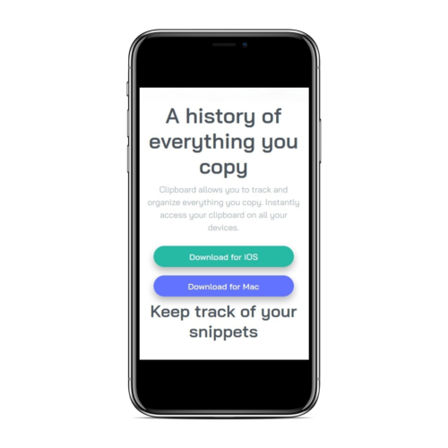
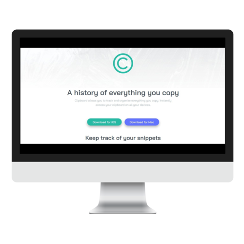

# Clipboard Landing Page

> The challenge is to build out this landing page and get it looking as close to the design as possible. You can find more information and the design files [here](https://www.frontendmentor.io/challenges/clipboard-landing-page-5cc9bccd6c4c91111378ecb9).

The project were made to the following widths:

  ## Mobile: 375px
  
  
  ## Desktop: 1440px
  
  
  

## Built With

- HTML,
- CSS,
- Bootstrap

## Live Demo

[Live Demo Link](https://vieiramanda11.github.io/Clipboard-Landing-Page/)

## Author

👤 **Amanda Vieira**

- Github: [@vieiramanda11](https://github.com/vieiramanda11)
- Twitter: [@mndvr_](https://twitter.com/mndvr_)
- Linkedin: [Amanda](https://www.linkedin.com/in/amandavieira23/)
